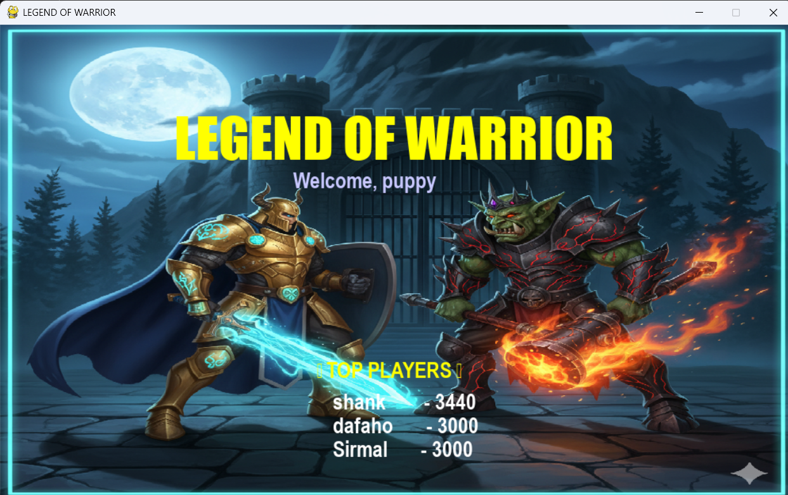
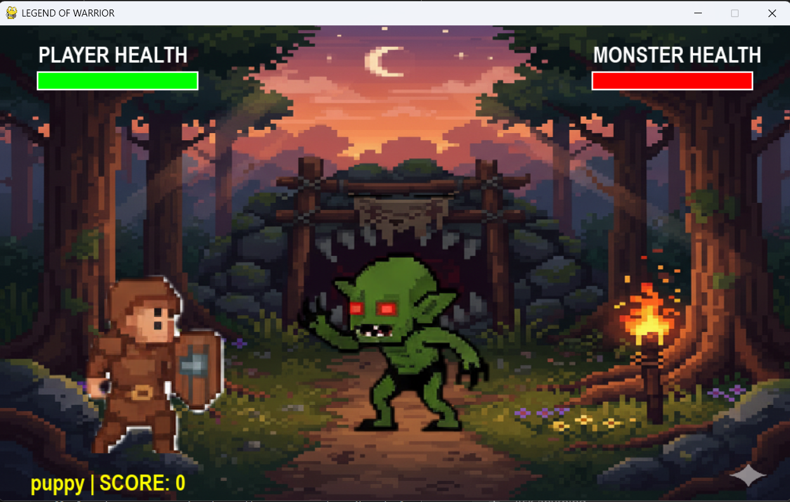
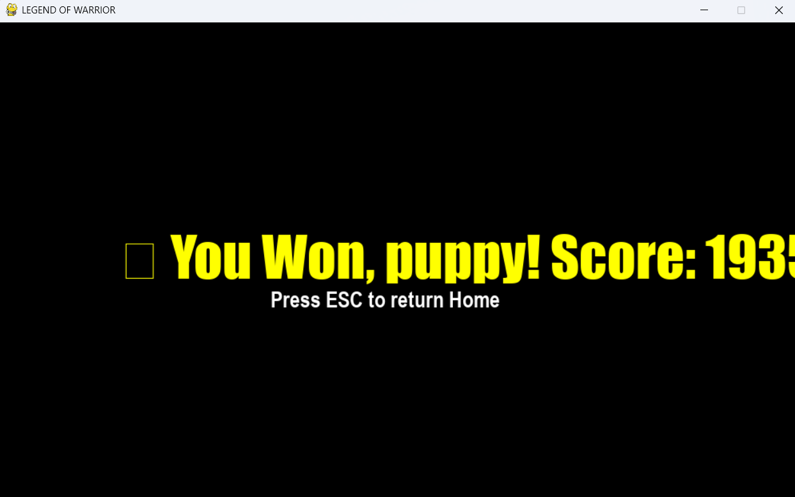

# 🛡️ MINI PROJECT REPORT  
## 🎮 LEGEND OF WARRIOR

A 2D Action-Adventure game developed using **Python (Pygame)** that combines sprite-based animation, background music, enemy AI, and an interactive player experience.  
This game demonstrates concepts of **Object-Oriented Programming**, **state management**, **collision detection**, **database handling**, and **animation logic** — built entirely using Python.

---

## 👥 TEAM DETAILS

| Name | Batch | Roll No | Role | Contributions |
|------|--------|----------|------|---------------|
| **Shankar Amar Sirmal (Leader)** | 2 | 326 | Lead Developer & Game Architect | Designed game architecture, character controls, animation system, and database integration. |
| **Soham Santosh Rasam** | 2 | 328 | Audio & Animation Developer | Integrated sound effects, background music per level, and optimized sprite animations. |
| **Vrundar Shrikant More** | 2 | 331 | UI & Database Developer | Created player input screen, leaderboard (SQLite), and health bar UI system. |
| **Shetty Jay** | 2 | 336 | Game Logic & Tester | Developed player movement, collision mechanics, and tested multi-level transitions. |

---

## 🧱 PROJECT ARCHITECTURE

LEGENDS-OF-WARRIOR/
│
├── assets/
│ ├── backgrounds/
│ ├── sounds/
│ ├── sprites/
│ └── fonts/
│
├── data/
│ └── game_data.db
│
├── scripts/
│ ├── main.py
│ ├── player.py
│ ├── monster.py
│ ├── animation.py
│ ├── audio.py
│ ├── ui.py
│ ├── database.py
│ ├── config.py
│ └── game_state.py
│
└── screenshots/
├── home.png
├── level1.png
└── game_won.png

---

## ⚙️ MODULE OVERVIEW

### 🏁 `main.py`
Handles the **main game loop**, event handling, and transitions between states (Home, Play, Win, Game Over).

### 🧍 `player.py`
Defines the **Warrior** class: movement, attack, jump, animation handling using sprite sheets, and firing projectiles.

### 👾 `monster.py`
Implements **Monster AI**: limited movement area, attack animations, and health management.

### 🎞️ `animation.py`
Loads and processes sprite sheets into frame sequences using **list comprehension** and frame-based animation timing.

### 🔊 `audio.py`
Manages background music and sound effects using `pygame.mixer`.  
Each level has its own `.wav` background track and `.mp3` sound effects (attack, fireball, monster sounds).

### 💾 `database.py`
Handles SQLite database operations — stores **top 3 player scores** and deletes older entries automatically (FIFO cleanup).

### 💬 `ui.py`
Draws health bars, leaderboard, and in-game UI texts (player name, score, health status).

### ⚙️ `game_state.py`
Central **state machine** for the game:  
Controls transitions between screens like Home, Play, Pause, Win, and Game Over.

### 🧩 `config.py`
Stores sprite layout configurations (rows, columns per level) for dynamic animation loading.

---

## 🎮 GAMEPLAY FLOW

1. **Start Screen** → Enter your name.  
2. **Home Menu** → Shows title, leaderboard, and “Press ENTER to Start”.  
3. **Gameplay**  
   - Move with `←` and `→`  
   - Jump with `↑`  
   - Attack with `A` or `Space`  
   - Fireball with `S`  
   - Pause/Resume with `P`  
4. **Victory / Defeat** → Display final score and save progress.  
5. **Leaderboard** → Top 3 scores shown on home screen.  

---

## 🧠 CONCEPTS LEARNED & APPLIED

| Concept | Implementation in Project |
|----------|--------------------------|
| **OOP (Object-Oriented Programming)** | Player, Monster, Projectile, Animator, AudioManager classes |
| **Inheritance** | Player and Monster classes extend `pygame.sprite.Sprite` |
| **List Comprehension** | Efficiently load frames from sprite sheets |
| **Event Handling** | Managed keypresses, attack triggers, and game states |
| **Collision Detection** | Using `pygame.Rect.colliderect()` for attacks and projectiles |
| **Database Handling** | Used `sqlite3` to save and retrieve player scores |
| **Modular Programming** | Game divided into independent modules for reusability |
| **State Management** | Implemented Home, Play, Win, and Pause using a central state machine |
| **Audio Integration** | Managed multiple background tracks and layered sound effects |
| **Exception Handling** | Added file validation and missing resource checks |

---
## 📸 GAME SCREENSHOTS

| 🏠 Home Screen | ⚔️ Level 1 Battle | 🏆 Game Won |
|----------------|------------------|-------------|
|  |  |  |

---
🚧 CHALLENGES FACED

Aligning sprite sheets: Each level had different row-column configurations; managing frame extraction dynamically was tricky.

Scaling issues: Characters initially appeared too large or off-screen; fixed via proportional scaling functions.

Sound overlap: Simultaneous effects caused delays — resolved with channel-based audio playback.

Database constraints: Needed FIFO deletion to maintain only 3 top records.

Frame alignment: Adjusted sprite rect anchors to keep warrior and monster on same ground plane.

---

🚀 FUTURE ENHANCEMENTS

Add Boss Battle levels and difficulty progression.

Introduce multiplayer (local PvP) mode.

Include power-ups and inventory system.

Create intro video/cutscene before level 1.

Implement mobile-compatible UI controls.

---

🧩 SAMPLE DATABASE TABLE
ID	Name	Level	High Score
1	Shankar	3	820
2	Soham	2	750
3	Vrundar	3	650

 ---

💡 LEARNINGS & REFLECTION

Through this project, the team learned:

How to combine programming logic with visual and audio design.

Structuring a complete software using modular code and OOP.

Real-time debugging of animation and sound synchronization.

Efficient use of SQLite databases for persistent game data.

How small gameplay mechanics (physics, AI, state) work together to form a complete game loop.

---

🧠 KEY PYTHON & PYGAME FEATURES USED

pygame.display for rendering

pygame.Rect for movement and collisions

pygame.mixer for music and sound

sqlite3 for leaderboard database

os.path for dynamic resource loading

time and get_ticks() for frame rate timing

🧰 SOFTWARE & TOOLS USED
Tool	Purpose
Python 3.13	Core programming language
Pygame 2.6.1	Game framework
SQLite3	Local leaderboard storage
VS Code	Development environment
GIMP / Photoshop	Sprite editing
Audacity	Sound editing

---

🏆 FINAL OUTCOME

The Legend of Warrior game successfully demonstrates:

Multi-level gameplay with increasing difficulty

Real-time sound and animation

Smooth transitions between screens

Persistent player data using SQLite

A complete game loop from menu → play → win/lose → leaderboard

---

🏁 CONCLUSION

This project is a complete example of how Python and Pygame can be used to create interactive 2D games.
It helped the team understand how programming logic, data structures, multimedia handling, and design patterns combine to create a modern, functional game.

Developed and Submitted by:
Batch 2 — Roll Nos. 326, 328, 331, 336

“Every bug fixed taught us something new — every frame drawn made us better programmers.”

---
